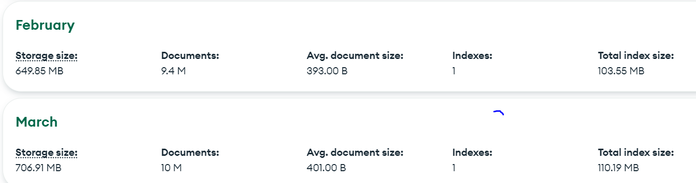
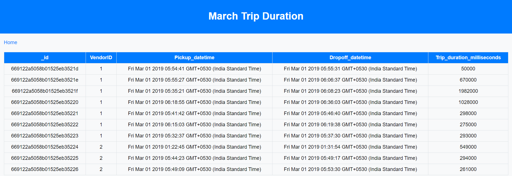
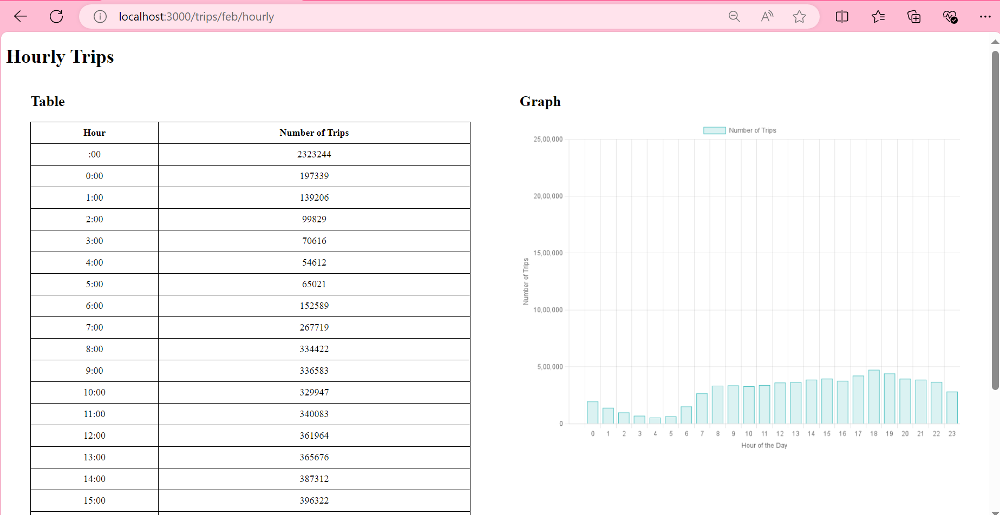

# Project Overview

## Project Title

NYC Taxi Trip Records Data Ingestion and Analysis

## Team Info

Srilikhita Balla   
S Jaya Harsha Vardhan

## Description

This project focuses on scraping, processing, storing, and analyzing NYC taxi trip record data from the NYC TLC (Taxi and Limousine Commission) website. The data is available in Parquet format and contains detailed trip records for February and March 2019. The processed data is stored in a MongoDB database, with insights and analysis served via a Node.js and Express backend, and presented using an HTML/CSS frontend.

## Purpose

The main goal of this project is to automate the ingestion of NYC taxi trip data into a MongoDB database and provide analytical insights through a web interface. This serves as a foundation for data analysis, enabling insights into taxi usage patterns, fare structures, trip characteristics, and vendor performance in New York City.

## Features

- **Web Scraping**: Automatically scrapes the NYC TLC website for trip record data in Parquet format.
- **Data Processing**: Reads and processes Parquet files using Pandas.
- **Database Storage**: Stores processed data in MongoDB collections based on the month of the trip records.
- **Backend Endpoints**: Provides endpoints for retrieving insights such as:
  - February month trips
  - March month trips
  - Duration of each trip
  - Duration of each vendor's trips along with the number of trips
  - Cleaned data
  - Revenue generated per hour
  - No of trips per hour
  - Distance analysis
  - Payment types analysis
- **Frontend Presentation**: Displays the insights using HTML and CSS.
- **Error Handling**: Includes error handling for download and data processing issues.

## Project Structure

MiniProject/  
├── my-express-app/  
│   ├── views/ * HTML and CSS scripts for the endpoints *  
│   │   ├── index.ejs  
│   │   ├── febTrips.ejs  
│   │   ├── marTrips.ejs  
│   │   ├── febDuration.ejs  
│   │   ├── marDuration.ejs  
│   │   ├── paymenttypes.ejs  
│   │   ├── distanceanalysis.ejs  
│   │   ├── hourlytrips.ejs  
│   │   └── hourlyrevenue.ejs  
│   ├── public/  
│   │   └── styles.css  
│   ├── node_modules/  
│   ├── modules/  
│   │   └── tripModel.js * MongoDB model for trip schema *  
│   ├── config/  
│   │   ├── db.js * MongoDB configuration file *  
│   │   ├── app.js * main application entry point *  
│   │   ├── package-lock.json * json source file *  
│   │   └── package.json * json source file *  
├── app.py  
├── Architecture diagram.png  
├── scrape.py * Python file for data ingestion *  
├── Transformations.py * Data is cleaned and transformed Backend *  
├── README.md  
├── images/ * contains all the images of the results from the get requests *  
└── .gitignore  

### Backend
• `Node.js` and `Express`: Used to create HTTP endpoints for data retrieval and insights.  
### Frontend
• `HTML` and `CSS`: Used to create a user-friendly interface for displaying insights.  
### Data Ingestion and Processing
• `requests`: Used for sending HTTP requests to the NYC TLC website.  
• `pandas`: Utilized for reading and processing Parquet files.  
• `BeautifulSoup`: Employed for parsing HTML and extracting links.  
• `pymongo`: Used for connecting to and interacting with MongoDB.  
• `io`: Handles input/output operations for reading Parquet files.  

## Architecture diagram


## How components interact

1. The Data Ingestion Script (scrape.py) sends an HTTP request to the NYC TLC Trip Record
   Data website to fetch Parquet files.
2. Connection with the database is established using the db.js file.
3. The script processes the fetched data using Pandas and inserts it into the MongoDB database
   under appropriate collections (e.g., February, March).
4. The Backend (Express.js) provides various endpoints to interact with the data in
   MongoDB, such as fetching trips for specific months and calculating trip durations(app.js).
5. The Frontend (HTML, CSS, JavaScript) makes API requests to the Backend to fetch data and
   display insights to the user in a user-friendly manner. The html or css files
   are combinedly written in ejs files and for some endpoints directly written inside the api calls.
6. The data modelling and transforming is done using (Transformations.py) file

## Installation and Setup

1. Prerequisites: Ensure you have the following installed:
   • Python
   • Node.js
   • MongoDB
   • Required Python libraries: `requests`, `pandas`, `BeautifulSoup4`, `pymongo`, `pyarrow`
   • Required Node.js libraries: `express`, `mongodb`

2. **Clone the Repository**:

   ```bash
   git clone https://github.com/Sr1l1kh1ta/Project.git
   cd Project
   ```

3. \*Install Dependencies\*\*:

   - **Python Dependencies**:
     ```bash
     pip install requests pandas beautifulsoup4 pymongo pyarrow
     ```
   - **Node.js Dependencies**:
     ```bash
     npm install express mongodb
     ```
   - **Additional Dependencies**:

   ```bash
   npm install mongoose body-parser chart.js chartjs-node-canvas
   ```

4. Set Up MongoDB: Make sure MongoDB is running on `mongodb://localhost:27017/`.

## Usage

- Data Ingestion:

  ```bash
  python scrape.py
  ```

  This script scrapes the NYC TLC website, processes the Parquet files, and stores the data in MongoDB.

- Start Backend Server:
  ```bash
  node app.js
  ```
  This starts the Express server and makes the endpoints available.

## Endpoints

- GET /trips/feb: Retrieves trips data for February.
- GET /trips/mar: Retrieves trips data for March.
- GET /trips/feb/duration: Retrieves the duration of each trip.
- GET /trips/mar/duration: Retrieves the duration of each trip.
- GET /trips/feb/duration/vendor: Retrieves the duration of trips for each vendor along with the number of trips in the month of feb
- GET /trips/mar/duration/vendor:Retrieves the duration of trips for each vendor along with the number of trips in the month of march
- GET /trips/feb/cleaned : Retrieves cleaned data of february month from the database.
- GET /trips/mar/cleaned : Retrieves cleaned data of march month from the database.
- GET /trips/feb/hourly: Generates the bar chart of hourly trips in february month.
- GET /trips/mar/hourly: Generates the bar chart of hourly trips in march month.
- GET /trips/feb/revenue : Generates the bar chart of hourly revenue in february month.
- GET /trips/mar/revenue : Generates the bar chart of hourly revenue in march month.
- GET /trips/feb/distance-analysis : Shows the distribution of trips among different distances in the month of february.
- GET /trips/mar/distance-analysis : Shows the distribution of trips among different distances in the month of march.
- GET /trips/feb/payment-types : Shows the payment type distribution in the month of february.
- GET /trips/mar/payment-types : Shows the payment type distribution in the month of march.


Frontend

- **index.ejs**: The ejs file that displays the insights.
- **styles.css**: CSS file for styling the frontend.
- **febTrips.ejs**: The ejs script that displays the insights of the endpoint /trips/feb.
- **marTrips.ejs**: The ejs script that displays the insights of the endpoint /trips/mar.
- **febDuration.ejs**: The ejs script that displays the insights of the endpoint /trips/feb/duration.
- **marDuration.ejs**: The ejs script that displays the insights of the endpoint /trips/mar/duration.
- **hourlytrips.ejs**: The ejs script that displays the insights of the endpoint /trips/feb/hourly and trips/mar/hourly.
- **hourlyrevenue.ejs**: The ejs script that displays the insights of the endpoint /trips/feb/revenue and /trips/mar/revenue.
- **paymenttypes.ejs**: The ejs script that displays the insights of the endpoint /trips/feb/payment-types and trips/mar/payment-types.
- **distanceanalysis.ejs**: The ejs script that displays the insights of the endpoint /trips/feb/distance-analysis and trips/mar/distance-analysis.  


## Data Schema
The data ingested into MongoDB will have the following schema:
- `_id`: MongoDB ObjectId <br>
- `VendorID`: Integer  <br>
- `tpep_pickup_datetime`: ISODate <br>
- `tpep_dropoff_datetime`: ISODate
- `passenger_count`: Integer
- `trip_distance`: Float
- `RatecodeID`: Integer
- `store_and_fwd_flag`: String
- `PULocationID`: Integer
- `DOLocationID`: Integer
- `payment_type`: Integer
- `fare_amount`: Float
- `extra`: Float
- `mta_tax`: Float
- `tip_amount`: Float
- `tolls_amount`: Float
- `improvement_surcharge`: Float
- `total_amount`: Float
- `congestion_surcharge`: Float
- `airport_fee`: Float or Null

## Error Handling

- Failed Requests: The script checks the HTTP status code of the response and prints an error message if the page fails to load.
- Download Errors: If a Parquet file fails to download, the script prints an error message.
- Processing Errors: If there are issues processing the Parquet file, the script catches the exception and prints an error message.

## Future Improvements

- Cloud Integration for better scalability, agility.We can use the following services  
  - AWS S3: Store raw and processed data in Amazon S3 for scalable and durable storage.  
  - AWS Lambda: Use AWS Lambda for serverless computing, allowing functions to run in response to events.  
  - AWS Glue: A managed ETL (Extract, Transform, Load) service to automate the data preparation process.  
  - AWS Athena: An interactive query service to analyze data in Amazon S3 using standard SQL.  
    Migrating the current project to cloud can imporve the scalability, elasticity, highavailability.   

## References

- NYC TLC Trip Record Data: [NYC TLC website](https://www.nyc.gov/site/tlc/about/tlc-trip-record-data.page)
- MongoDB: [MongoDB Documentation](https://docs.mongodb.com/)
- Pandas: [Pandas Documentation](https://pandas.pydata.org/pandas-docs/stable/)
- Requests: [Requests Documentation](https://docs.python-requests.org/en/latest/)
- BeautifulSoup: [BeautifulSoup Documentation](https://www.crummy.com/software/BeautifulSoup/bs4/doc/)
- Express¬: [Express Documentation](https://expressjs.com/)

This comprehensive overview provides a detailed guide for understanding, setting up, and contributing to the project. It ensures that both developers and users can effectively engage with and utilize the project's functionalities.

